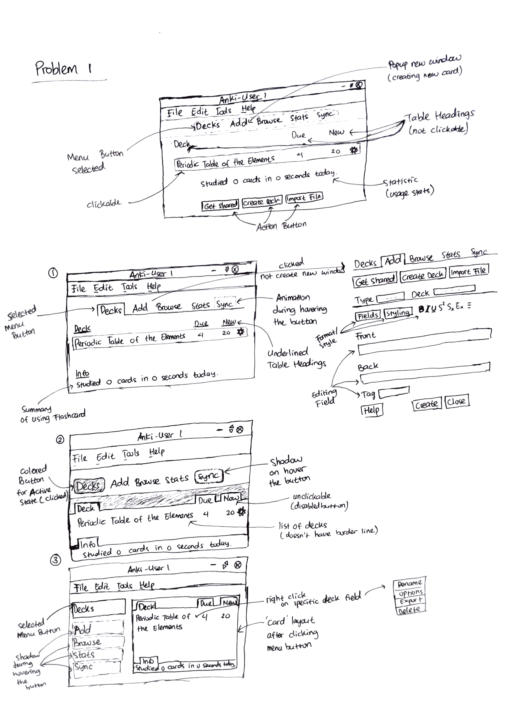
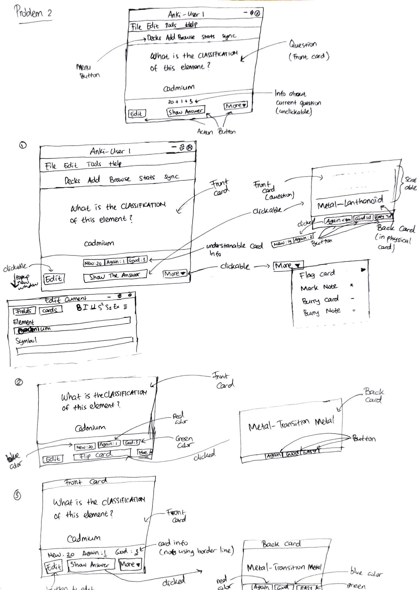
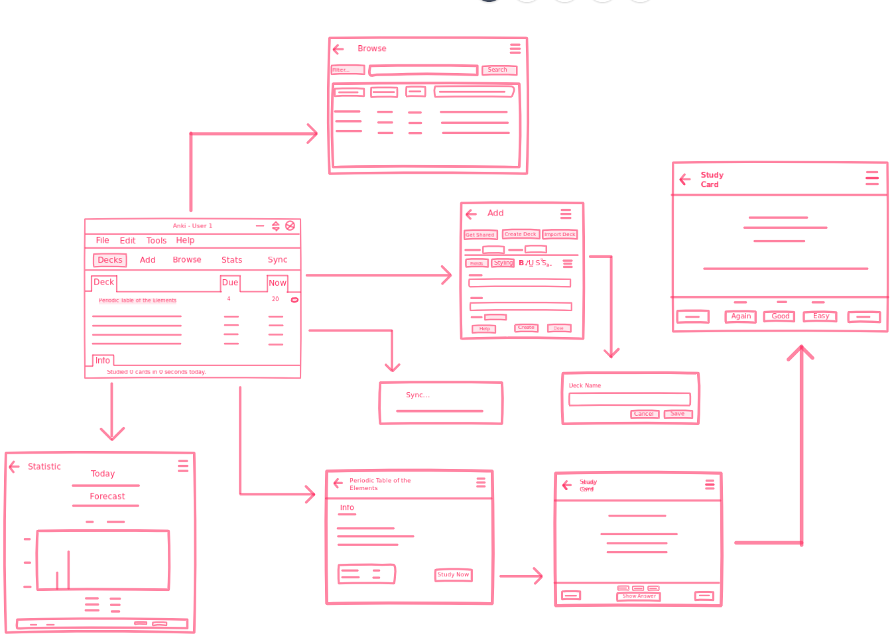

# Sketching and Prototyping Anki Desktop Application

Using the information in the results of Assignment 1 for what is good and bad about the UI for designed tasks, we are going to make **Sketches** and **Prototypes**. These sketches and prototypes will lead to better design in Assignment 3. The prototypes will be then tested through a usability evaluation followed by design revision in Assignment 4.

## Part A: Sketches

Sketch at least **3 (three)** different UIs for the functions you are targeting. These three interfaces should be _dramatically different_ in terms of design directions. For example, they can be with different organizations of what functions on each screen or using a different layout of the icons, widgets, and menus on the screens. If you want, you can also incorporate non-on-screen UIs: physical buttons, gestures through motion sensors, etc.

You need **not** sketch the whole interface. It is not necessary for the sketches to have every function or every function in detail, but there should be enough to show off your general idea. **Be creative!** Draw your idea and label a few of the widgets so we can tell your intent. The goal is to have at least 3 good UIs in *interesting* ways. Sketches should be done on paper with pens and/or pencils (do not use a computer).

### 1. Scan/Photo of Sketches

#### 1.1 Problem 1

#### 1.2 Problem 2

### 2. Version Differences

#### 2.1 Solution Problem 1

#### 2.1.1 Problem

1. Menu bar button feels like plain text, hard to find menu bar on the first place.
2. Action buttons on below deck list must be moved to _Add_ page for easily access.
3. Statistic of usage must be separated with different position than on deck list.

#### 2.1.2 Solution

* Solution 1
    1. Create _nav_ layout on menu bar button. When it activated, there is some border line on top of it.
    2. Create separated statistical usage under the deck list.

* Solution 2
    1. Menu bar must be separated with color. When it active or selected, button color is blue.
    2. Change deck list layout with _nav_ layout.
    3. Separate statistical usage with _nav_ layout.

* Solution 3
    1. Change menu bar button layout to vertical and active button is selected with blue color.
    2. Deck list is separated with _card_ layout on right side of menu bar button.

#### 2.2 Solution Problem 2

#### 2.2.1 Problem

1. Hard to understand info card (learning pattern).
2. Show Answer button not flipped the card but make it scrollable.

#### 2.2.2 Solution

* Solution 1
    1. Add text info (_new_, _again_, _good_) on learning pattern
    2. Make _show answer_ button wider.
    3. Make the back card more scrollable.

* Solution 2
    1. Separate learing pattern info with different color.
    2. Change _show answer_ to _flip card_.
    3. Flip the card (with animation) after clicked _show answer_ button.

* Solution 3
    1. Add header title on front card and back card
    2. Separate learning pattern info and not using border line because it is not button.
    3. Separate four button for rating the content on back card.

### 3. Selected Sketch

I choose solution 2 on problem 1 because it looks cleaner and make it more compact. Menu bar layout more like button than text hyperlink. Title of each section is more strong because there are _nav_ menu around text title. The info section is on below of content and wrap with separate layout, giving an informative impression.

### 4. Design Rationale

From learning contextual inquiry, the designer can get different perspective from other user and their wishes with our application's usability.

## Part B: Assumptions

### 1. Hardware

1. Screen size (minimum) : 13.3 inch
2. Screen Resolution : higher than or equal to 1360 x 768 pixels
3. Computer Specification (minimum) :
    * Memory : 2 Gb
    * Intel/AMD CPU
4. Has mouse and keyboard input

### 2. Users

1. Familiar with Flash Card learning method
2. Have passion to read documentation
3. User is students or workers
4. User age between 17-50 years old
5. Understand to operate computer and internet

## Part C: Prototypes

* Freehand:

* Low Fidelity Link

    [https://invis.io/QRR8E05DM9C#/354680511_Screenshot_2019-03-27_HCI_-_Assignment_2-1-](https://invis.io/QRR8E05DM9C#/354680511_Screenshot_2019-03-27_HCI_-_Assignment_2-1-)

* High Fidelity Link

    [https://invis.io/QRR8E05DM9C#/355954860_Deck](https://invis.io/QRR8E05DM9C#/355954860_Deck)